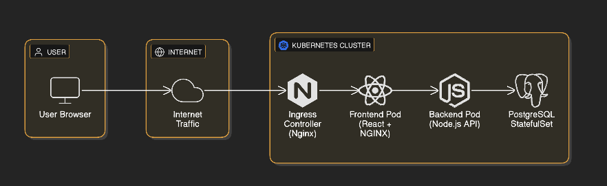

# 🌊 Neptune Stack — Cloud-Native Microservices on Kubernetes

<p align="center">
<<<<<<< HEAD
  
  
  
  
</p>

---

## 📸 Screenshots

> **Home Page:**
>
> 
>
> **Architecture Diagram:**
>
> 
>
---

## 🏷️ Technology Badges

<p align="center">
=======
>>>>>>> 5e26854598d1cf6a8c1733571bf7e56964cb61e5
  
  
  
  
  
  
  
  
</p>

---

## 📸 Screenshots

> **Home Page:**
>
> 


---

## 🏗️ Overview

**Neptune Stack** is a fully containerized, cloud‑native microservices application designed to replicate real‑world, production‑grade Kubernetes deployments. It demonstrates:

* Modern DevOps workflows
* Kubernetes orchestration and scaling
* Secure container best practices
* CI/CD–ready infrastructure
* Multi‑service cloud architecture

Includes:

* **React (frontend UI)**
* **Node.js/Express (backend API)**
* **PostgreSQL (database)**
* **Kustomize-powered Kubernetes manifests** for Dev & Prod
* **Systemd automation** for long-running port-forwarding

---

## ⚙️ Technology Stack

| Layer        | Technology               | Purpose                            |
| ------------ | ------------------------ | ---------------------------------- |
| **Frontend** | React + NGINX            | SPA served via container           |
| **Backend**  | Node.js (Express)        | API & business logic               |
| **Database** | PostgreSQL + PVC         | Persistent reliable storage        |
| **Platform** | Kubernetes               | Orchestration, networking, scaling |

---

## 🚀 Key Production Features

* Multi-service full-stack deployment
* Kubernetes-native scaling with **HPA**
* High availability via **PodDisruptionBudgets**
* Zero-trust segmentation using **NetworkPolicies**
* Secure containers (non-root, read-only FS)
* Persistent storage via **PVC + StatefulSet**
* Dev/Prod config via **Kustomize overlays**
* Automatic port-forwarding via **systemd service**
* Makefile-driven automation

---

## 🗂️ Project Structure

```
NeptuneStack/
├── Makefile                        # Automation tasks
├── README.md                       # Documentation
├── app/                            # Frontend + Backend source
│   ├── backend/                    # Express API
│   └── frontend/                   # React frontend
├── docker-compose.yaml             # Local Dev
├── dockerhub-username.sh           # Swap DockerHub image registry
├── infra/                          # Infrastructure automation
│   ├── scripts/                    # Install/uninstall systemd service
│   └── systemd/                    # systemd unit template
└── k8s/                             # Full Kubernetes manifests
    ├── base/                       # Shared base config
    ├── overlays/                   # Dev/Prod overlays
    └── storageclass.yaml           # Dynamic provisioning
```

---

## 🧱 Deployment Workflow

### 1️⃣ Configure DockerHub Namespace

```bash
chmod +x dockerhub-username.sh
./dockerhub-username.sh <your-dockerhub-username>
```

### 2️⃣ Local Development

```bash
make compose
```

### 3️⃣ Install Kubernetes Tools

```bash
make kind
```

### 4️⃣ Create Local Kubernetes Cluster

```bash
make create
```

### 5️⃣ Build & Push Docker Images

```bash
make build push REG=<your-dockerhub-username>
```

### 6️⃣ Create Namespace & Secrets

```bash
kubectl apply -f k8s/base/namespace.yaml
cp k8s/base/secret-app.example.yaml k8s/base/secret-app.yaml
nano k8s/base/secret-app.yaml
kubectl -n neptune apply -f k8s/base/secret-app.yaml
```

### 7️⃣ Deploy Neptune Stack

Dev:

```bash
make apply-dev
```

Prod:

```bash
make apply-prod
```

### 8️⃣ Validate Deployment

```bash
make validate
```

---

## 9️⃣ Access the Application

# Option A — Using Systemd Auto Port-Forward (Recommended)

Neptune Stack includes an automated **systemd service** that exposes the Kubernetes `neptune-web` service directly on your local machine.

### **1️⃣ Install the Port-Forward Service**

```bash
chmod +x infra/scripts/install-port-forward.sh
sudo ./infra/scripts/install-port-forward.sh
```

### **2️⃣ Start the Service**

```bash
sudo systemctl start neptune-port-forward@<your-username>
```

Once started, access the application at:

```
http://localhost
```

### **3️⃣ Check Service Status**

```bash
sudo systemctl status neptune-port-forward@<your-username>
```

### **4️⃣ Stop the Service**

```bash
sudo systemctl stop neptune-port-forward@<your-username>
```

### **5️⃣ Disable & Uninstall (Optional)**

```bash
sudo systemctl disable neptune-port-forward@<your-username>
chmod +x infra/scripts/uninstall-port-forward.sh
sudo ./infra/scripts/uninstall-port-forward.sh
```

---

### Option B — Manual Port-Forward

```bash
kubectl -n neptune port-forward svc/neptune-web 8080:80
```

→ [http://localhost:8080](http://localhost:8080)

---

## 🔐 Security Features

* RBAC with dedicated service accounts
* Zero-trust networking via NetworkPolicies
* Non-root, read-only containers
* Secrets stored securely
* PodDisruptionBudgets for HA

---

## 📊 Scalability & Reliability

* Horizontal Pod Autoscaler (HPA)
* Liveness & Readiness probes
* Stateful database with PVC
* Auto-restart and self-healing deployments

---

## 💼 Recruiter Highlights

Demonstrates expertise in:

* Kubernetes production architecture
* Infrastructure-as-Code (Kustomize)
* Secure, scalable microservices
* Real DevOps workflows
* CI/CD readiness

Ideal roles: **DevOps Engineer • Kubernetes Engineer • Cloud Engineer • SRE**

---

